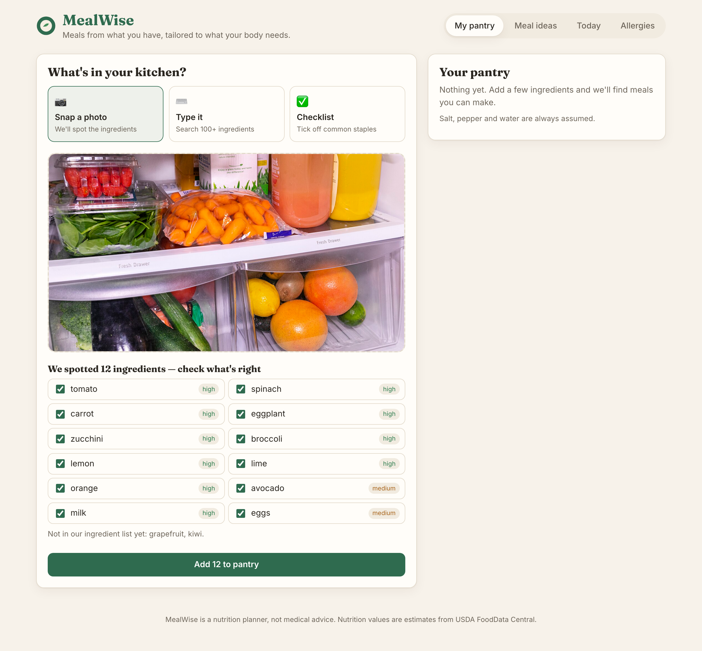
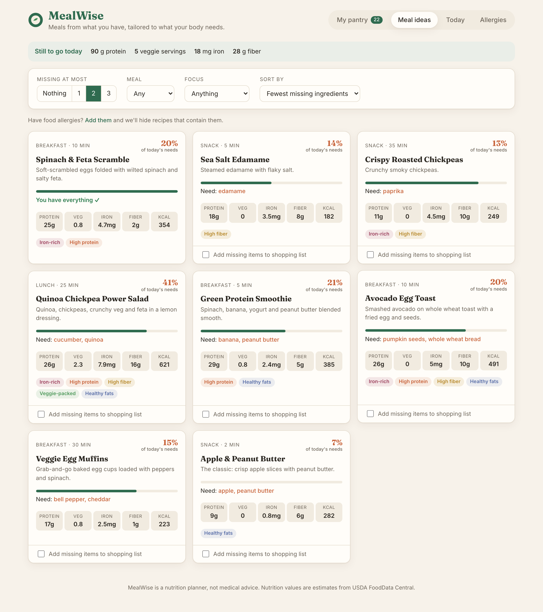
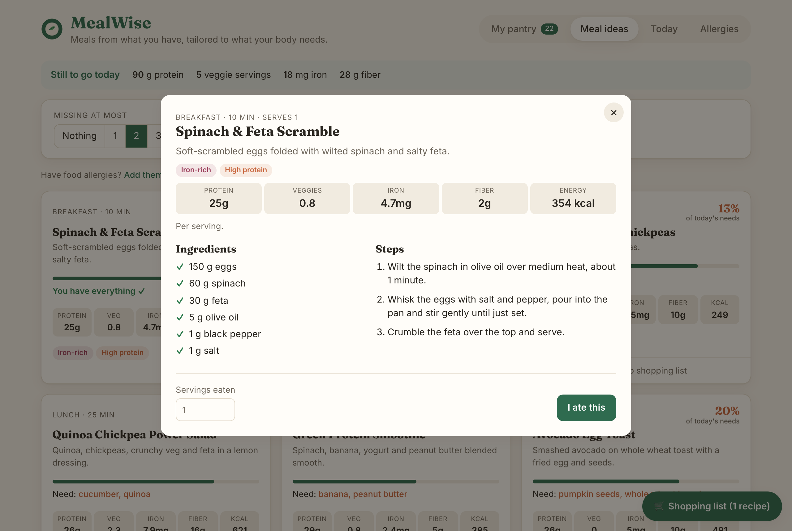
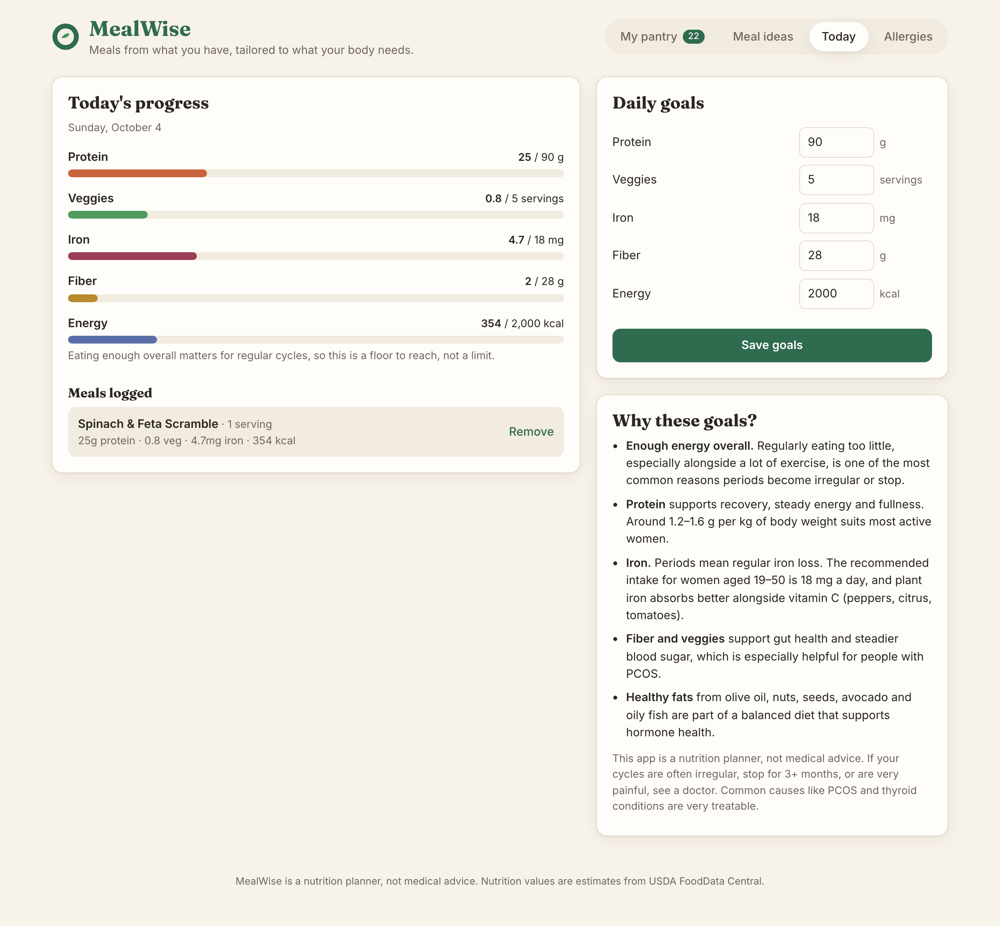
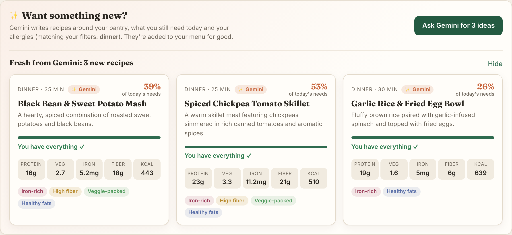
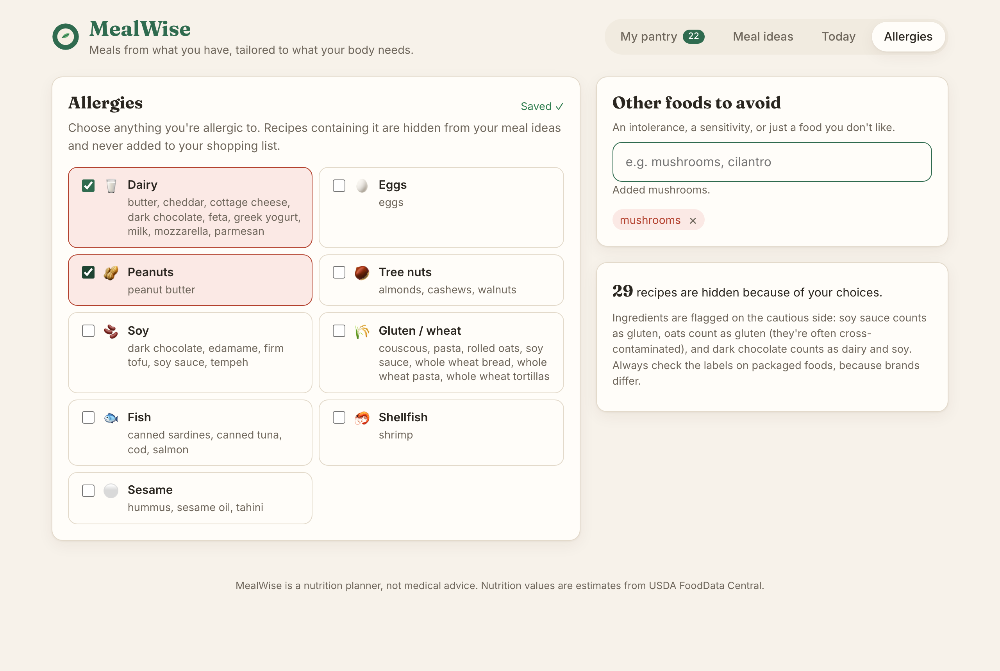
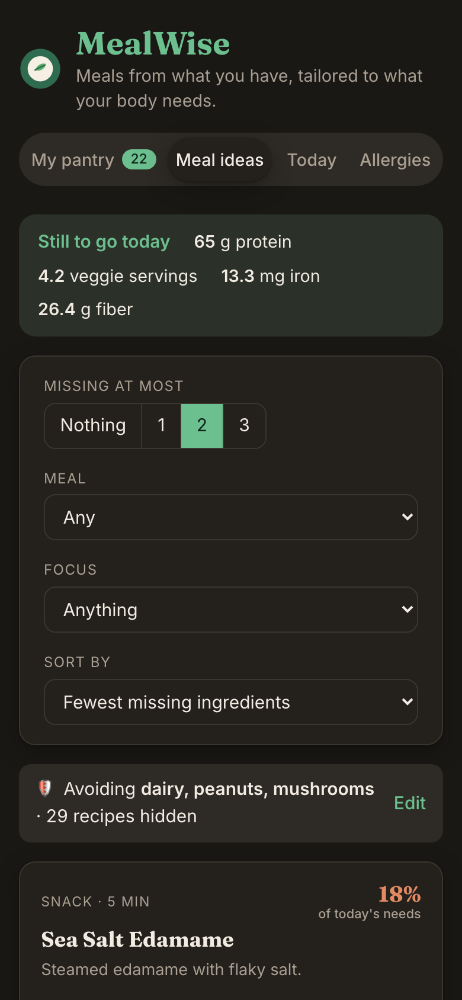
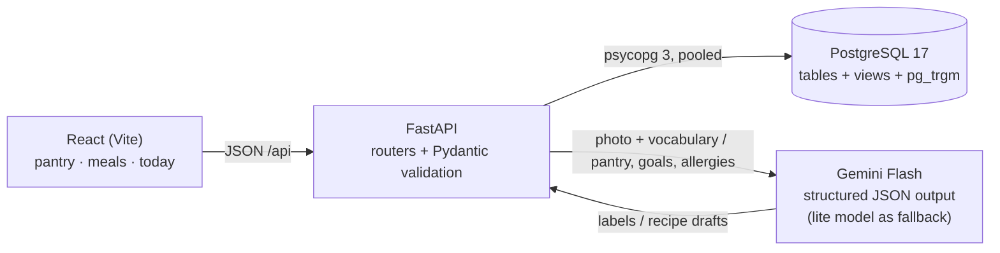
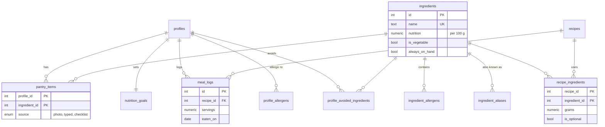

# MealWise

**Meals from what you have, tailored to what your body needs.**

Snap a photo of your fridge (or type or tick off what you have), and MealWise suggests recipes
you can make right now. They are ranked by how few ingredients you're missing and how well each
meal closes the gap on today's protein, veggie, iron and fiber goals. I built it around a personal
goal: eating in a way that supports a regular menstrual cycle.

**▶ Live demo: _link coming soon_**: free hosting, so the first load after a quiet period
takes about a minute while the server wakes up.



| Meal ideas ranked by what you have | Recipe detail | Daily goals |
|---|---|---|
|  |  |  |

| New recipes written by Gemini | Allergies and foods to avoid | Mobile (dark) |
|---|---|---|
|  |  |  |

## Features

- **Three ways to stock your pantry**
  - 📷 **Photo:** Gemini Flash detects ingredients. You review a checklist (with confidence levels)
    before anything is saved, because AI can mislabel things.
  - ⌨️ **Type:** search-as-you-type handles aliases ("garbanzo" → chickpeas, "courgette" →
    zucchini) and typos ("brocoli").
  - ✅ **Checklist:** one tap for common staples.
- **Recipe matcher:** 50 recipes ranked by missing ingredients, then by goal fit. Optional
  ingredients never count as missing, and basics like salt are assumed.
- **✨ Ask Gemini for new ideas:** Gemini writes new recipes around your pantry, what you still
  need today, your allergies and your current filters (meal type, focus). Valid recipes are
  saved, so the menu keeps growing, and you can remove any you don't like. Gemini only chooses
  ingredients and amounts; the database calculates all the nutrition, just as it does for the
  curated recipes.
- **Allergies and foods to avoid:** pick from the FDA's nine major allergens (dairy, eggs,
  peanuts, tree nuts, soy, gluten/wheat, fish, shellfish, sesame) and/or add specific foods.
  Recipes that need any of them are hidden, the shopping list never suggests them, and an
  optional ingredient you avoid is marked "skip it" instead of hiding the whole recipe.
- **Goal-aware ranking:** each recipe shows how much of *today's remaining* need it covers, and
  the score updates as you log meals.
- **Cycle-support tags:** iron-rich, high-protein, high-fiber, veggie-packed and healthy fats,
  all calculated from nutrition data instead of typed in by hand.
- **Meal log and progress bars** against editable daily goals.
- **Shopping list** that combines missing ingredients across the recipes you pick.
- **Built for a public demo:** every visitor automatically gets a private profile (no sign-up),
  Gemini recipes are visible only to the visitor who created them, and AI use is capped per
  day so the free API quota can't be exhausted.

## Architecture



**Photo flow:** the image goes to Gemini along with the catalog's ingredient names, and Gemini
returns JSON that must match a schema. Each label is then matched to a real ingredient in
**one SQL query** (`unnest` + `LATERAL` + trigram similarity). The user confirms the list before
anything is written.

**Recipe generation flow:** the server builds the context (pantry, today's remaining protein,
veggies, iron and fiber, the allowed ingredient list with avoided foods removed, and existing
titles) and asks Gemini for recipes in a fixed JSON format. **Nothing Gemini returns is trusted
as-is.** Every draft is re-validated before it's saved:

- ingredient names must resolve to the catalog (exactly, or by alias or strict fuzzy match)
- anything on your avoid list rejects the recipe, even if Gemini ignored the prompt
- titles must be unique, ignoring case
- amounts, servings, cooking time and steps must be realistic
- duplicate ingredients are merged

Rejected drafts are shown with the reason. If the main model is overloaded, the client retries
with backoff and then falls back to a lighter Gemini model.

## Database design

The database does the heavy lifting. Nutrition is stored **once, per 100 g, on each ingredient**.
Recipes store only grams, so every nutrition number in the app is derived and can never drift
out of sync.



Highlights (see [`db/schema.sql`](db/schema.sql)):

- **Normalized many-to-many** (`recipe_ingredients`), with composite primary keys and `CHECK`
  constraints on every nutrition value and goal range.
- **Views:** `recipe_nutrition` sums each ingredient's nutrition into per-serving values, and
  `recipe_tags` derives the cycle-support tags from those numbers.
- **Allergies:** `ingredient_allergens` maps each ingredient to one or more allergens (soy
  sauce → soy *and* gluten). A `profile_avoided` view combines a person's allergen groups with
  their individually avoided foods, so the matcher, recipe detail and shopping list all apply the
  same rule from one place.
- **The matcher** ([`recipes.py`](backend/app/routers/recipes.py)) is one CTE pipeline. It finds
  what you have and what you must avoid, then calculates each recipe's coverage (`COUNT … FILTER`, `ARRAY_AGG` of
  what's missing), today's remaining goals and a weighted fit score, all in a single round trip.
- **Fuzzy search** with the `pg_trgm` extension and GIN indexes, across names and aliases.
- **Seed integrity:** recipes are written by ingredient *name* and resolved to ids at load time.
  A `DO` block aborts the seed if any name fails to resolve, so a typo can't silently drop an
  ingredient.
- A `profiles` table scopes every per-person row. Visitors get an anonymous profile through
  a **signed cookie** (an HMAC, so it can't be edited to read someone else's data), and adding
  real accounts later needs no schema change.
- `ai_requests` logs each Gemini call to enforce rolling 24-hour limits per visitor and overall.

## Tech stack

| Layer | Choice |
|---|---|
| Database | PostgreSQL 17 (Docker), `pg_trgm` |
| Backend | Python 3.11+, FastAPI, Pydantic, psycopg 3 with a connection pool, raw SQL (no ORM, on purpose) |
| AI | Google Gemini Flash (`google-genai`), structured JSON output, retries with backoff on rate limits |
| Frontend | React 19 + Vite, plain CSS with design tokens, light and dark mode, responsive |
| Quality | pytest (75 tests against a real Postgres test database), GitHub Actions CI |

## Run it locally

You need Docker, Python 3.11+ and Node 20+.

```bash
cp .env.example .env          # optional: add a free GEMINI_API_KEY for photo scanning
make setup                    # install backend + frontend dependencies
make seed                     # start Postgres and load the schema + 50 recipes
make api                      # terminal 1 → http://localhost:8010/docs
make web                      # terminal 2 → http://localhost:5173
```

Get a free Gemini key at [aistudio.google.com/apikey](https://aistudio.google.com/apikey).
Without a key, photo scanning shows a friendly message and everything else still works. Try it
with the sample photo in [`docs/samples/`](docs/samples/).

Interactive API docs are generated automatically at `http://localhost:8010/docs`.

## Deploy your own (free)

The app ships as **one Docker image**: FastAPI serves both the API and the built React app.
The database creates and seeds itself on first start, and later deploys never touch it.

1. **Database:** create a free project at [neon.com](https://neon.com) (permanent free plan, no
   credit card) and copy its connection string.
2. **App:** on [render.com](https://render.com), choose **New → Blueprint** and pick this repo.
   [`render.yaml`](render.yaml) sets up a free web service. Paste `DATABASE_URL` (from Neon) and
   `GEMINI_API_KEY` when asked; `SECRET_KEY` is generated for you.
3. Every push to `main` redeploys automatically.

Optional settings: `AI_LIMIT_PER_VISITOR` (default 15/day), `AI_LIMIT_TOTAL` (default 200/day),
`GEMINI_MODEL`, `GEMINI_FALLBACK_MODEL`.

## API

| Method | Endpoint | Purpose |
|---|---|---|
| GET | `/api/ingredients?q=` | Fuzzy search (names + aliases) |
| GET | `/api/ingredients/common` | Checklist staples |
| GET / POST / DELETE | `/api/pantry` | List, add (idempotent) or clear the pantry |
| DELETE | `/api/pantry/{ingredient_id}` | Remove one item |
| POST | `/api/pantry/scan` | Photo → detected ingredients (not saved until confirmed) |
| GET | `/api/recipes/matches` | Ranked matches. Filters: `max_missing`, `meal_type`, `tag`, `sort=missing\|goals` |
| GET | `/api/recipes/{id}` | Recipe with steps, and which ingredients you have |
| POST | `/api/recipes/generate` | Ask Gemini for 1–5 new recipes (`meal_type`, `focus` optional); returns created + rejected |
| DELETE | `/api/recipes/{id}` | Remove a Gemini recipe (curated → 403, already logged → 409) |
| GET | `/api/shopping-list?recipe_ids=` | Missing ingredients combined across recipes |
| GET / PUT | `/api/goals` | Daily goals (validated ranges) |
| GET / PUT | `/api/allergies` | Allergens + avoided foods (PUT replaces the set), with the hidden-recipe count |
| GET / POST | `/api/meals` | Day summary vs. goals, or log a meal |
| DELETE | `/api/meals/{id}` | Remove a logged meal |

## Testing

```bash
make test
```

The tests run against a real, separate Postgres database (`mealwise_test`), which is
recreated each run and reset between tests, so the SQL is tested for real rather than mocked.
Gemini is replaced with a fake through FastAPI dependency overrides, so tests are fast, free and
deterministic. They cover:

- matching, sorting, filters and optional ingredients
- per-serving nutrition checked against hand-calculated values
- goal-fit scoring responding to logged meals
- fuzzy search (aliases and typos), and mapping photo labels to the catalog
- recipe generation: catalog checks, allergy safety net, duplicates, unrealistic drafts, delete rules
- allergies: hiding recipes, ingredients with two allergens, optional ingredients, shopping list
- visitor isolation: separate pantries, forged cookies, private AI recipes, daily AI limits
- validation and error paths (404 / 413 / 415 / 422 / 502 / 503)
- Gemini retry, backoff and fallback-model behavior

## Design decisions

- **Raw SQL instead of an ORM.** The interesting logic (coverage, scoring, fuzzy matching) is
  relational, so it lives in the database where it runs in one query and can be read on its own.
- **AI proposes, the database decides.** Generated recipes contain only ingredient names and
  grams. Nutrition, tags and ranking are calculated in SQL from the same catalog as everything
  else, so an AI recipe can't invent a misleading "40 g protein" claim.
- **Human in the loop for AI.** Photo results are suggestions. Low-confidence guesses start
  unchecked, and labels outside the catalog are shown rather than silently dropped.
- **AI sits behind interfaces** (`IngredientDetector`, `RecipeGenerator`) over one shared
  Gemini client, so switching providers means changing one class, and tests use fakes.
- **Allergies are flagged cautiously.** Soy sauce counts as gluten, oats count as gluten
  (they're usually cross-contaminated) and dark chocolate counts as dairy and soy. The UI tells
  users to check labels, because a recipe app can't know a specific brand's ingredients.
- **Responsible health framing.** Thresholds use published values (for example, 18 mg/day of
  iron for women aged 19–50, and an 80 g veggie portion). The app frames calories as a floor, not
  a limit, and states clearly that it is not medical advice.

## What I'd build next

- Optional accounts, so a profile can follow you across devices (the schema is already ready)
- Cycle-phase logging, to see how intake lines up with how you feel
- Recipe import from a URL, with ingredient parsing
- Let Gemini suggest new catalog ingredients (reviewed before they're added)

---

Nutrition data is approximated from [USDA FoodData Central](https://fdc.nal.usda.gov/). The
sample fridge photo is CC0, by Alabama Extension via Wikimedia Commons.
